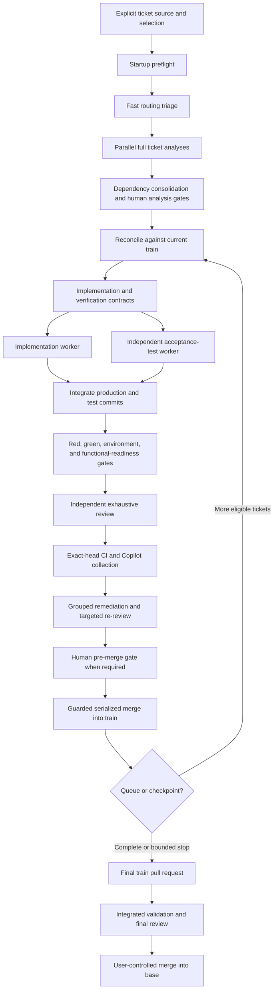

# Ticket Train

Ticket Train is an explicitly invoked Codex skill for orchestrating bounded,
reviewable implementation batches from a user-provided ticket source. It keeps
analysis, implementation, acceptance testing, remediation, and review in
separate visible contexts while the main conversation acts as a compact control
plane. A deterministic state machine owns phase order, concurrency, gates,
routing checks, pull-request targets, and completion; prompts remain responsible
for technical judgment. A deterministic runner emits bounded decision packets,
suppresses unchanged waits, and rotates the replaceable main adapter before its
conversation becomes a dominant cost center.

The skill is designed for multi-ticket work where sequencing, dependency
management, verification quality, human approval, context growth, and token
cost all need explicit control.

## What it does

Ticket Train can:

- read tickets supplied directly, from a repository file, from GitHub, or from
  another supported tracker;
- triage up to five tickets concurrently and route each full analysis according
  to provisional criticality and complexity;
- consolidate dependencies and implementation collisions before scheduling
  work;
- run up to two proven-independent implementation/test pairs concurrently;
- author acceptance tests in a context, branch, and worktree separate from the
  implementation;
- require baseline-red, exact-head green, environment-parity, and applicable
  Supabase/Auth/RLS evidence before code review;
- perform one exhaustive independent review, group accepted findings into a
  bounded remediation cycle, and use targeted re-review by default;
- merge ticket pull requests into a train one at a time and finish with a final
  train pull request against the repository base branch;
- report architecture, functional, data, contract, security, operational, test,
  review, manual-validation, and token-usage outcomes;
- persist enough durable state to reconcile interrupted or restarted runs;
- build every model handoff as a bounded, hash-addressed context packet with
  no inherited conversation history;
- run exact-head verification commands with a deterministic zero-token runner;
- reject invalid or skipped lifecycle transitions through a revision-checked,
  idempotent procedural controller;
- identify one canonical run across main conversations, prevent duplicate
  analysis, and transfer orchestration through an explicit single-owner lease;
- suppress unchanged orchestration without a model wake and rotate the
  orchestrator through a single-use, history-free controlled handoff;
- install verified supervision before child work starts and surface every
  human approval as an explicit main-conversation action.

Ticket Train does not infer a ticket source, silently use hidden workers, weaken
tests to obtain a green result, close source tickets without authorization, or
merge the train into `main` or `master` without an explicit user request.

## Requirements

- A Codex environment that supports personal skills.
- A Git repository for live execution.
- User-visible thread management for the intended multi-context workflow.
- GitHub access when live execution must push branches and create pull requests.
- An authorized connector or CLI for external ticket sources.
- The credentials and representative test environments required by the
  selected tickets.

If a required visible thread, repository permission, credential, or environment
is unavailable, the workflow reports a blocker instead of silently degrading
the validation model.

## Installation

Place this repository at:

```text
$CODEX_HOME/skills/ticket-train
```

If `CODEX_HOME` is not defined, use the default Codex skills directory:

```text
~/.codex/skills/ticket-train
```

Restart or reload Codex if the skill is not detected immediately.

## Invocation

The skill never starts implicitly. Invoke it with `$ticket-train` and provide a
ticket source and selection.

Example dry-run:

```text
Use $ticket-train in dry-run mode for the first three tickets in
docs/backlog.md using standard approvals.
```

Example live run:

```text
Use $ticket-train in live mode for issues 42, 43, and 47 from the current
GitHub repository using auto-analysis approvals.
```

Example Unity run using the local AI Game Dev MCP server and the default pool
of three editors:

```text
Use $ticket-train in live mode for features 25, 26, and 35 from this Unity
repository using local Unity MCP and auto-analysis approvals.
```

The launch prompt may override the pool in ordinary language, for example:
`with at most 2 Unity editors open`.

The orchestrator resolves and reports the source, ticket order, approval mode,
run mode, repository, base and train branches, reasoning cap, model routing,
verification requirements, proportionality profile, size budget, and token
reporting policy before work begins.

It also recommends an orchestrator model and reasoning effort and requires an
explicit startup confirmation. Reasoning above `xhigh` always requires separate
user authorization.

Reusing the same repository, train branch, source, and ticket set discovers
the existing run even from another main conversation. The new conversation
adopts or explicitly takes over that run; it does not rerun completed triage
or analysis merely to reconstruct context.

## Dry-run and live execution

In `dry-run` mode, Ticket Train performs ticket normalization, routing triage,
full read-only analyses, dependency consolidation, scheduling, validation-gate
assessment, model routing, and simulated implementation/review planning. It
does not modify files, create branches or pull requests, commit, push, merge,
or start implementation workers.

For Unity, a dry run may provision the persistent editor-slot pool and use an
exact detached base for a read-only editor-backed analysis. It still cannot
modify tracked project content or Git history.

In `live` mode, it executes the complete branch, test, review, remediation, and
train workflow subject to project rules and all required gates.

## Approval modes

Approval modes configure only human validation gates. Automated analysis,
tests, functional readiness, independent review, remediation, reporting,
reasoning authorization, and train limits remain mandatory in every mode.

| Mode | Human analysis gate | Human pre-merge gate |
|---|---:|---:|
| `standard` | Applied | Applied |
| `auto-analysis` | Bypassed | Applied |
| `auto-merge` | Applied | Bypassed |
| `full-auto` | Bypassed | Bypassed |

`auto-merge` and `full-auto` authorize ticket integration into the train when
all automated gates pass. They never authorize merging the train into the
repository base branch.

## Workflow



### 1. Source normalization and triage

The user explicitly selects tickets. Ticket Train preserves their wording and
normalizes identifiers, descriptions, priorities, acceptance criteria,
dependencies, references, source location, and source revision.

A short `Terra/H` triage assigns provisional criticality and complexity only
for routing. It does not replace the full analysis.

### 2. Parallel analysis and consolidation

Every selected ticket receives one full analysis from a common base commit,
with at most five active analyses. Analyses start without waiting for other
analyses or human approvals.

The orchestrator then consolidates dependencies, shared contracts, invariants,
file collisions, migrations, and execution ordering. Material amendments return
to the original analysis context instead of starting another full analysis.

### 3. Criticality, complexity, and human gates

Criticality measures the consequence of a plausible failure. Complexity
measures implementation and verification difficulty. The two dimensions stay
separate and drive:

- analysis, implementation, acceptance-test, review, and re-review routing;
- human analysis approval;
- human validation before a ticket enters the train;
- scope and train-size checkpoints.

The detailed evidence rules and matrices are documented in
[criticality.md](references/criticality.md) and
[model-routing.md](references/model-routing.md).

### 4. Independent implementation and acceptance tests

For each eligible ticket, the orchestrator creates two branches and worktrees
from the same exact train commit:

```text
train commit
├── ticket implementation branch/worktree
└── independent acceptance-test branch/worktree
```

The test worker receives the approved behavior and verification contract, but
not the implementation diff. It commits its first acceptance suite and
baseline evidence before implementation details are disclosed. The test commit
is then integrated into the implementation branch through a dedicated test pull
request or equivalent durable merge.

The implementation worker owns production code and implementation-proximate
unit tests. The independent test worker owns behavior-level, integration,
environment, migration, access-control, and end-to-end acceptance evidence.

For Unity projects, these branches are checked out in persistent
`unity-slot-N` worktrees only when a phase needs the local editor or MCP.
Threads do not each receive their own editor. Analysis, implementation, tests,
review, Play Mode/UI verification, builds, and remediation share one exclusive
pool capped at three editors by default. See
[unity-mcp-local.md](references/unity-mcp-local.md).

### 5. Functional-readiness gate

Review begins only after the integrated ticket head proves:

- complete acceptance-criterion coverage;
- valid baseline-red evidence or justified non-applicability;
- passing exact-head green evidence;
- required environment parity;
- applicable Supabase/Auth/RLS checks through real user boundaries;
- no unresolved validation failure;
- no ordinary automatable scenario deferred to the user.

Any failure is classified as an implementation defect, test defect,
environment defect, contract ambiguity, or infrastructure flake before the
workflow spends a full review pass.

### 6. Review and remediation

Each stable ticket scope receives one exhaustive independent review. Codex,
Copilot, CI, and human findings are deduplicated into one ledger. Accepted
findings are grouped into a compact remediation packet rather than handled in
many conversational loops.

The ticket PR is marked ready before GitHub collection. The ledger records the
exact collection interval, source counts, CI state, Copilot state, and durable
evidence for the same head. Collection may finish early when CI is terminal and
Copilot has responded; otherwise unavailable/timeout conclusions wait for a
deadline at least ten minutes after collection begins.

Every confirmed behavioral defect requires a reproducing regression test.
Follow-up review is targeted by default and expands to another full review only
when remediation materially changes architecture, migrations, authorization,
contracts, or another protected risk surface. Automatic remediation stops
after two cycles and reports a root-cause and cost checkpoint.

### 7. Train integration and finalization

Ticket pull requests merge into the train one at a time through the bundled
guarded merge command. It rechecks the controller permit, live PR head/base,
draft state, and successful completed GitHub checks immediately before merge.
Direct agent-issued GitHub merge commands are outside the workflow. Open ticket branches
are refreshed against the updated train and affected evidence is rerun before
their merge.

The train freezes after five integrated tickets or an earlier cumulative-size
checkpoint. Finalization creates or updates one train-to-base pull request,
runs cross-ticket acceptance and environment checks on its exact head, performs
an independent final review, then opens a bounded GitHub feedback window. One
exact-head snapshot inventories Codex, CI, Copilot, and human findings; every
finding receives one technical disposition before readiness. A new head
invalidates that snapshot and triggers focused verification and collection
again. Finalization starts automatically when the selected queue is terminal;
the user does not need to request the PR or reconfirm the resolved base branch.

Only the user may merge that final pull request, either directly or by an
explicit request to Codex. The `auto-merge` approval mode concerns ticket
branches entering the train; it never authorizes train-to-base merge. A Codex
final merge requires a head-specific recorded user authorization and the same
live guarded merge command.

## Branch and pull-request model

```text
base branch
└── train branch
    ├── ticket implementation branch
    │   └── independent test pull request into implementation
    ├── ticket pull request into train
    └── serialized remediation pull requests when needed

final train pull request: train -> base
```

This model gives every ticket a durable diff and review history while avoiding
uncontrolled parallel merges into the train.

## Concurrency and cost controls

- At most five active analysis threads.
- At most two active implementation workers.
- At most one acceptance-test worker per implementation.
- At most two active implementation/test pairs.
- At most one merge into the train at a time.
- For Unity local MCP, at most three leased/open editor slots by default, or
  the explicit launch-prompt override.
- One exhaustive review per stable scope.
- At most two grouped remediation/re-review cycles.
- Deterministic supervision and log extraction instead of repeated model turns.
- Maximum 16 KiB orchestrator decision packets and zero model wake for
  unchanged state.
- Automatic controlled orchestrator rotation at 25 million segment tokens, 50
  model wakes, 500 tool calls, or one context compaction, with a warning at 10
  million tokens.
- Compact handoff packets for remediation and follow-up review.
- A 50-million-token phase circuit breaker, a one-compaction limit, and a
  follow-up/initial-review ratio checkpoint.
- Exact-if-available token accounting by session, ticket, and phase.
- Deterministic orchestration metrics by action count, measured duration, and
  exact action-token deltas, with justified, unjustified, unattributed, and
  avoided model-wake counts.

Ticket Train also maintains a proportionality profile so recommendations stay
aligned with the product's real actors, credible threats, protected boundaries,
and MVP scope. Recommendations are separated into minimum required correction,
optional hardening, and explicitly deferred post-MVP work.

## Durable control and recovery

The main thread stores compact decisions and status while detailed work remains
in visible phase threads. A durable manifest records phase identities, launch
attempts, branches, pull requests, test evidence, reviews, token snapshots, and
gate states outside the target repository.

The current main thread is a thin, replaceable adapter. It reads a maximum 16
KiB decision packet produced by `control_plane_runner.py`, performs the named
Codex/Git/GitHub action, and records the result as an immutable event. It does
not read the complete manifest or reconstruct the schedule from chat history.
Unsupported transitions fail closed, including implementation without a
parallel independent-test task, review before functional readiness, focused
re-review without a full baseline, ticket PRs targeting the base branch, and
completion without the final PR/review/token/report evidence.

Missing information is also procedural state. A worker can return
`needs_input`, or the orchestrator can record a product/legal/environment
question directly. The controller then exposes one explicit `ACTION REQUIRED`
packet with the exact question, accepted answer formats, blocked scope, and
work that continues independently. After the answer, the same visible worker
is resumed when applicable.

Every run has one fingerprint, one canonical manifest under
`$CODEX_HOME/ticket-train/runs`, and one orchestrator lease. Before creating a
run, the registry searches for an existing match. A new main conversation must
adopt the existing state or receive explicit takeover authorization. Completed
analysis artifacts are reused or targeted for reconciliation instead of being
silently repeated.

The registry also detects manifests from the deprecated
`$CODEX_HOME/ticket-trains` layout. It blocks a fresh run until those manifests
are adopted into a canonical reconciliation shell, inventoried, and resolved.

Supervision is resolved before any child starts. Long work prefers an
event-driven wait on visible tasks or verified child-to-orchestrator completion
callbacks. A background watcher is accepted only when it is a genuine
zero-model process; a recurring Codex heartbeat automation is not used for
polling. Verified visible child tasks are the normal progress indicator, so
the orchestrator does not periodically restate that they are still running. If
controller state says work is active but no verified visible task exists, that
visibility gap is surfaced immediately. The user does not need to create a
scheduled task.

Each main conversation is one measured orchestration segment. At a hard
activity threshold, the owner prepares a bounded packet and single-use token,
creates one fresh visible successor, and atomically transfers the same run
lease. The former conversation becomes read-only. No analysis, implementation,
or review phase is repeated, and the successor does not inherit old turns.

Foreground waiting exists only for the current orchestrator turn. If a task
creation returns a queued client ID, the orchestrator resolves the actual
visible thread and keeps waiting in that turn. The controller rejects yielding
with queued, running, or launch-unknown foreground work; only a verified
background watcher can protect work after a turn ends.

Human gates are first-class durable state. Every approval request is headed
`ACTION REQUIRED` in the main conversation, contains a self-sufficient decision
packet and exact accepted replies, and states whether any technical task is
still active. When the gate is the only remaining action, the watcher is
paused or deleted and the train waits silently for the reply: there is no
recurring AI heartbeat and no default repeated reminder. An explicitly
requested reminder is a deterministic product notification, never a replay of
the orchestrator context. Supervision is reinstated before work resumes.

Final pull-request feedback is first-class state too: collection window,
deadline, snapshot ID, exact head, source counts, unresolved review threads,
per-finding dispositions, and remediation verification are all stored before
the train can complete.

The bundled deterministic tools support this control plane:

- [`train_controller.py`](scripts/train_controller.py) is the authoritative
  state machine and next-action planner;
- [`control_plane_runner.py`](scripts/control_plane_runner.py) creates bounded
  wake packets, suppresses unchanged state, and enforces orchestrator budgets;
- [`orchestration_metrics.py`](scripts/orchestration_metrics.py) classifies
  every controller action, records action spans and wakes, and generates the
  scripted-versus-AI execution audit;
- [`merge_pull_request.py`](scripts/merge_pull_request.py) is the only
  agent-authorized ticket or final PR merge path and rechecks live GitHub state;
- [`train_supervisor.py`](scripts/train_supervisor.py) reconciles thread,
  GitHub, test, and verification events into the run manifest;
- [`context_packet.py`](scripts/context_packet.py) creates bounded,
  hash-addressed, history-free handoffs;
- [`verification_runner.py`](scripts/verification_runner.py) executes exact-head
  command plans and stores full logs without an LLM supervision loop;
- [`run_registry.py`](scripts/run_registry.py) creates, discovers, and claims
  canonical runs without duplicate ownership;
- [`control_guard.py`](scripts/control_guard.py) diagnoses older manifests;
  current lifecycle authority belongs only to the procedural controller;
- [`token_usage.py`](scripts/token_usage.py) captures and reconciles available
  token counters.
- [`unity_slot_manager.py`](scripts/unity_slot_manager.py) initializes and
  leases persistent local Unity worktrees, opens editors, verifies MCP
  readiness, and performs bounded recovery;
- [`unity_slot_adapter.py`](scripts/unity_slot_adapter.py) executes one
  controller-authorized Unity resource transition and records its event
  without prompt-authored lifecycle decisions.

After an interruption, the orchestrator reconstructs current state from the
manifest, Git, threads, and pull requests before scheduling more work.

## Reports

The main conversation receives concise but self-sufficient reports for:

- startup configuration and routing;
- ticket analyses and structural impacts;
- dependencies and scheduling;
- implementation and important file diffs;
- independent verification and environment evidence;
- review findings and their dispositions;
- train integration and final pull-request readiness;
- manual tests that remain genuinely useful;
- code and application attention points;
- per-phase, per-ticket, per-session, and aggregate token usage;
- scripted-versus-AI orchestration shares and model-wake quality, with explicit
  measurement coverage.

The report formats are defined in
[report-template.md](references/report-template.md).

## Repository layout

```text
ticket-train/
├── README.md
├── LICENSE
├── SKILL.md
├── agents/
│   └── openai.yaml
├── references/
│   ├── analysis-policy.md
│   ├── control-plane-runner.md
│   ├── controller-protocol.md
│   ├── criticality.md
│   ├── efficiency-policy.md
│   ├── model-routing.md
│   ├── orchestration-control.md
│   ├── report-template.md
│   ├── review-policy.md
│   ├── run-continuity.md
│   ├── ticket-sources.md
│   ├── usage-reporting.md
│   ├── unity-mcp-local.md
│   ├── verification-policy.md
│   └── workflow.md
└── scripts/
    ├── control_guard.py
    ├── control_plane_runner.py
    ├── context_packet.py
    ├── merge_pull_request.py
    ├── orchestration_metrics.py
    ├── run_registry.py
    ├── test_ticket_train_tools.py
    ├── test_train_controller.py
    ├── test_unity_slot_manager.py
    ├── token_usage.py
    ├── train_controller.py
    ├── train_supervisor.py
    ├── unity_slot_adapter.py
    ├── unity_slot_manager.py
    └── verification_runner.py
```

`SKILL.md` is the Codex entry point. The reference files hold the complete
policies and matrices, while the scripts enforce deterministic state and
accounting checks.

## Limitations

- The workflow cannot guarantee that software contains no defects; it is
  designed to prevent ordinary automatable defects from being knowingly
  deferred to human testing.
- External service behavior can only be validated when a safe representative
  environment and required credentials are available.
- Token totals are exact only when the host exposes compatible counters and a
  valid baseline; unavailable measurements are reported rather than estimated.
- Repository rules and applicable `AGENTS.md` instructions always take
  precedence over this generic workflow.
- The local controller cannot directly call the Codex desktop task API. The
  active main conversation still performs tool calls, but it no longer decides
  their order or whether lifecycle gates passed. This host adapter is awakened
  only for changed state and rotated under a hard context budget.

## License

Ticket Train is available under the [MIT License](LICENSE). You may use,
modify, redistribute, sublicense, or sell copies, including in proprietary
work, provided that the copyright and license notice are retained. Modified
versions do not need to be contributed back to this repository.
