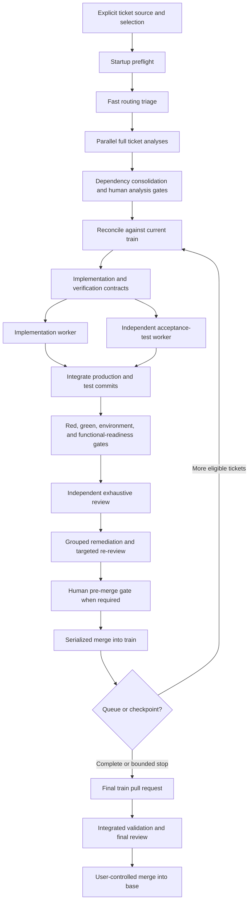

# Ticket Train

Ticket Train is an explicitly invoked Codex skill for orchestrating bounded,
reviewable implementation batches from a user-provided ticket source. It keeps
analysis, implementation, acceptance testing, remediation, and review in
separate visible contexts while the main conversation acts as a compact control
plane.

The skill is designed for multi-ticket work where sequencing, dependency
management, verification quality, human approval, context growth, and token
cost all need explicit control.

## What it does

Ticket Train can:

- read tickets supplied directly, from a repository file, from GitHub, or from
  another supported tracker;
- triage up to five tickets concurrently and route each full analysis according
  to provisional criticality and complexity;
- consolidate dependencies and implementation collisions before scheduling
  work;
- run up to two proven-independent implementation/test pairs concurrently;
- author acceptance tests in a context, branch, and worktree separate from the
  implementation;
- require baseline-red, exact-head green, environment-parity, and applicable
  Supabase/Auth/RLS evidence before code review;
- perform one exhaustive independent review, group accepted findings into a
  bounded remediation cycle, and use targeted re-review by default;
- merge ticket pull requests into a train one at a time and finish with a final
  train pull request against the repository base branch;
- report architecture, functional, data, contract, security, operational, test,
  review, manual-validation, and token-usage outcomes;
- persist enough durable state to reconcile interrupted or restarted runs.
- identify one canonical run across main conversations, prevent duplicate
  analysis, and transfer orchestration through an explicit single-owner lease;
- install verified supervision before child work starts and surface every
  human approval as an explicit main-conversation action.

Ticket Train does not infer a ticket source, silently use hidden workers, weaken
tests to obtain a green result, close source tickets without authorization, or
merge the train into `main` or `master` without an explicit user request.

## Requirements

- A Codex environment that supports personal skills.
- A Git repository for live execution.
- User-visible thread management for the intended multi-context workflow.
- GitHub access when live execution must push branches and create pull requests.
- An authorized connector or CLI for external ticket sources.
- The credentials and representative test environments required by the
  selected tickets.

If a required visible thread, repository permission, credential, or environment
is unavailable, the workflow reports a blocker instead of silently degrading
the validation model.

## Installation

Place this repository at:

```text
$CODEX_HOME/skills/ticket-train
```

If `CODEX_HOME` is not defined, use the default Codex skills directory:

```text
~/.codex/skills/ticket-train
```

Restart or reload Codex if the skill is not detected immediately.

## Invocation

The skill never starts implicitly. Invoke it with `$ticket-train` and provide a
ticket source and selection.

Example dry-run:

```text
Use $ticket-train in dry-run mode for the first three tickets in
docs/backlog.md using standard approvals.
```

Example live run:

```text
Use $ticket-train in live mode for issues 42, 43, and 47 from the current
GitHub repository using auto-analysis approvals.
```

The orchestrator resolves and reports the source, ticket order, approval mode,
run mode, repository, base and train branches, reasoning cap, model routing,
verification requirements, proportionality profile, size budget, and token
reporting policy before work begins.

It also recommends an orchestrator model and reasoning effort and requires an
explicit startup confirmation. Reasoning above `xhigh` always requires separate
user authorization.

Reusing the same repository, train branch, source, and ticket set discovers
the existing run even from another main conversation. The new conversation
adopts or explicitly takes over that run; it does not rerun completed triage
or analysis merely to reconstruct context.

## Dry-run and live execution

In `dry-run` mode, Ticket Train performs ticket normalization, routing triage,
full read-only analyses, dependency consolidation, scheduling, validation-gate
assessment, model routing, and simulated implementation/review planning. It
does not modify files, create branches or pull requests, commit, push, merge,
or start implementation workers.

In `live` mode, it executes the complete branch, test, review, remediation, and
train workflow subject to project rules and all required gates.

## Approval modes

Approval modes configure only human validation gates. Automated analysis,
tests, functional readiness, independent review, remediation, reporting,
reasoning authorization, and train limits remain mandatory in every mode.

| Mode | Human analysis gate | Human pre-merge gate |
|---|---:|---:|
| `standard` | Applied | Applied |
| `auto-analysis` | Bypassed | Applied |
| `auto-merge` | Applied | Bypassed |
| `full-auto` | Bypassed | Bypassed |

`auto-merge` and `full-auto` authorize ticket integration into the train when
all automated gates pass. They never authorize merging the train into the
repository base branch.

## Workflow



### 1. Source normalization and triage

The user explicitly selects tickets. Ticket Train preserves their wording and
normalizes identifiers, descriptions, priorities, acceptance criteria,
dependencies, references, source location, and source revision.

A short `Terra/H` triage assigns provisional criticality and complexity only
for routing. It does not replace the full analysis.

### 2. Parallel analysis and consolidation

Every selected ticket receives one full analysis from a common base commit,
with at most five active analyses. Analyses start without waiting for other
analyses or human approvals.

The orchestrator then consolidates dependencies, shared contracts, invariants,
file collisions, migrations, and execution ordering. Material amendments return
to the original analysis context instead of starting another full analysis.

### 3. Criticality, complexity, and human gates

Criticality measures the consequence of a plausible failure. Complexity
measures implementation and verification difficulty. The two dimensions stay
separate and drive:

- analysis, implementation, acceptance-test, review, and re-review routing;
- human analysis approval;
- human validation before a ticket enters the train;
- scope and train-size checkpoints.

The detailed evidence rules and matrices are documented in
[criticality.md](references/criticality.md) and
[model-routing.md](references/model-routing.md).

### 4. Independent implementation and acceptance tests

For each eligible ticket, the orchestrator creates two branches and worktrees
from the same exact train commit:

```text
train commit
├── ticket implementation branch/worktree
└── independent acceptance-test branch/worktree
```

The test worker receives the approved behavior and verification contract, but
not the implementation diff. It commits its first acceptance suite and
baseline evidence before implementation details are disclosed. The test commit
is then integrated into the implementation branch through a dedicated test pull
request or equivalent durable merge.

The implementation worker owns production code and implementation-proximate
unit tests. The independent test worker owns behavior-level, integration,
environment, migration, access-control, and end-to-end acceptance evidence.

### 5. Functional-readiness gate

Review begins only after the integrated ticket head proves:

- complete acceptance-criterion coverage;
- valid baseline-red evidence or justified non-applicability;
- passing exact-head green evidence;
- required environment parity;
- applicable Supabase/Auth/RLS checks through real user boundaries;
- no unresolved validation failure;
- no ordinary automatable scenario deferred to the user.

Any failure is classified as an implementation defect, test defect,
environment defect, contract ambiguity, or infrastructure flake before the
workflow spends a full review pass.

### 6. Review and remediation

Each stable ticket scope receives one exhaustive independent review. Codex,
Copilot, CI, and human findings are deduplicated into one ledger. Accepted
findings are grouped into a compact remediation packet rather than handled in
many conversational loops.

Every confirmed behavioral defect requires a reproducing regression test.
Follow-up review is targeted by default and expands to another full review only
when remediation materially changes architecture, migrations, authorization,
contracts, or another protected risk surface. Automatic remediation stops
after two cycles and reports a root-cause and cost checkpoint.

### 7. Train integration and finalization

Ticket pull requests merge into the train one at a time. Open ticket branches
are refreshed against the updated train and affected evidence is rerun before
their merge.

The train freezes after five integrated tickets or an earlier cumulative-size
checkpoint. Finalization creates or updates one train-to-base pull request,
runs cross-ticket acceptance and environment checks on its exact head, performs
an independent final review, collects external comments, and reports remaining
manual validation and attention points.

Only the user may merge that final pull request, either directly or by an
explicit request to Codex.

## Branch and pull-request model

```text
base branch
└── train branch
    ├── ticket implementation branch
    │   └── independent test pull request into implementation
    ├── ticket pull request into train
    └── serialized remediation pull requests when needed

final train pull request: train -> base
```

This model gives every ticket a durable diff and review history while avoiding
uncontrolled parallel merges into the train.

## Concurrency and cost controls

- At most five active analysis threads.
- At most two active implementation workers.
- At most one acceptance-test worker per implementation.
- At most two active implementation/test pairs.
- At most one merge into the train at a time.
- One exhaustive review per stable scope.
- At most two grouped remediation/re-review cycles.
- Deterministic supervision and log extraction instead of repeated model turns.
- Compact handoff packets for remediation and follow-up review.
- Exact-if-available token accounting by session, ticket, and phase.

Ticket Train also maintains a proportionality profile so recommendations stay
aligned with the product's real actors, credible threats, protected boundaries,
and MVP scope. Recommendations are separated into minimum required correction,
optional hardening, and explicitly deferred post-MVP work.

## Durable control and recovery

The main thread stores compact decisions and status while detailed work remains
in visible phase threads. A durable manifest records phase identities, launch
attempts, branches, pull requests, test evidence, reviews, token snapshots, and
gate states outside the target repository.

Every run has one fingerprint, one canonical manifest under
`$CODEX_HOME/ticket-train/runs`, and one orchestrator lease. Before creating a
run, the registry searches for an existing match. A new main conversation must
adopt the existing state or receive explicit takeover authorization. Completed
analysis artifacts are reused or targeted for reconciliation instead of being
silently repeated.

The registry also detects manifests from the deprecated
`$CODEX_HOME/ticket-trains` layout. It blocks a fresh run until those manifests
are adopted into a canonical reconciliation shell, inventoried, and resolved.

Supervision is resolved before any child starts. Long work uses a verified
run-scoped watcher when the orchestrator cannot remain in foreground wait. It
checks deterministic state at most every five minutes, reports transitions
immediately, and provides a compact liveness confirmation at least every 15
minutes. The user does not need to create a scheduled task.

Human gates are first-class durable state. Every approval request is headed
`ACTION REQUIRED` in the main conversation, contains a self-sufficient decision
packet and exact accepted replies, and remains visible in liveness updates
until resolved.

The bundled deterministic tools support this control plane:

- [`train_supervisor.py`](scripts/train_supervisor.py) reconciles thread,
  GitHub, test, and verification events into the run manifest;
- [`run_registry.py`](scripts/run_registry.py) creates, discovers, and claims
  canonical runs without duplicate ownership;
- [`control_guard.py`](scripts/control_guard.py) prevents unsafe yield,
  completion, or functional-readiness transitions;
- [`token_usage.py`](scripts/token_usage.py) captures and reconciles available
  token counters.

After an interruption, the orchestrator reconstructs current state from the
manifest, Git, threads, and pull requests before scheduling more work.

## Reports

The main conversation receives concise but self-sufficient reports for:

- startup configuration and routing;
- ticket analyses and structural impacts;
- dependencies and scheduling;
- implementation and important file diffs;
- independent verification and environment evidence;
- review findings and their dispositions;
- train integration and final pull-request readiness;
- manual tests that remain genuinely useful;
- code and application attention points;
- per-phase, per-ticket, per-session, and aggregate token usage.

The report formats are defined in
[report-template.md](references/report-template.md).

## Repository layout

```text
ticket-train/
├── README.md
├── LICENSE
├── SKILL.md
├── agents/
│   └── openai.yaml
├── references/
│   ├── analysis-policy.md
│   ├── criticality.md
│   ├── efficiency-policy.md
│   ├── model-routing.md
│   ├── orchestration-control.md
│   ├── report-template.md
│   ├── review-policy.md
│   ├── run-continuity.md
│   ├── ticket-sources.md
│   ├── usage-reporting.md
│   ├── verification-policy.md
│   └── workflow.md
└── scripts/
    ├── control_guard.py
    ├── run_registry.py
    ├── test_ticket_train_tools.py
    ├── token_usage.py
    └── train_supervisor.py
```

`SKILL.md` is the Codex entry point. The reference files hold the complete
policies and matrices, while the scripts enforce deterministic state and
accounting checks.

## Limitations

- The workflow cannot guarantee that software contains no defects; it is
  designed to prevent ordinary automatable defects from being knowingly
  deferred to human testing.
- External service behavior can only be validated when a safe representative
  environment and required credentials are available.
- Token totals are exact only when the host exposes compatible counters and a
  valid baseline; unavailable measurements are reported rather than estimated.
- Repository rules and applicable `AGENTS.md` instructions always take
  precedence over this generic workflow.

## License

Ticket Train is available under the [MIT License](LICENSE). You may use,
modify, redistribute, sublicense, or sell copies, including in proprietary
work, provided that the copyright and license notice are retained. Modified
versions do not need to be contributed back to this repository.
